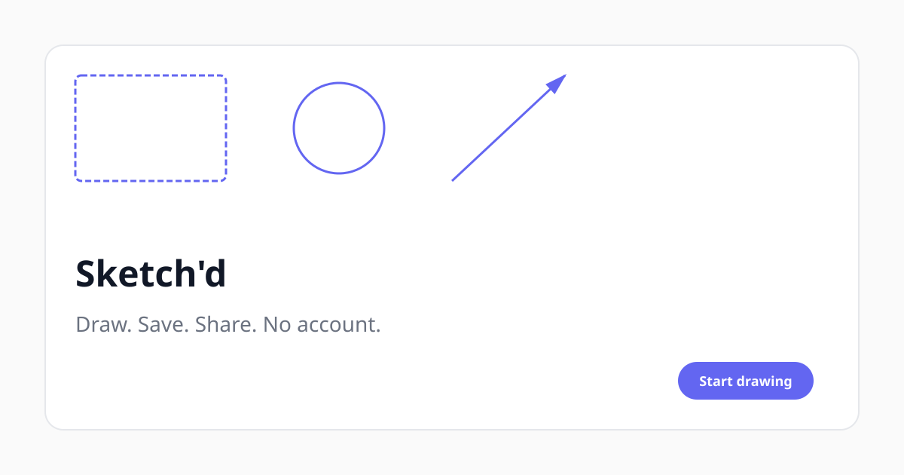

# Sketch'd

**Draw. Save. Share. No account.**

A fast, open-source infinite canvas where drawings can be saved directly to GitHub and shared with a URL.

No login. No signup. No workspace. No friction.

```
Open → Draw → Save → Share
```



## Features

- **Canvas-first design** — Full viewport drawing with floating UI
- **Zero account friction** — Open and draw immediately
- **GitHub-native persistence** — Save drawings to GitHub (local-first fallback)
- **Shareable URLs** — `sketchd.dev/d/quiet-moon-42`
- **Developer tool feel** — Command palette (⌘K), keyboard shortcuts, context menus
- **Premium themes** — System / Light / Dark with layered surfaces
- **PWA-ready** — Installable with proper manifest and icons
- **Mobile support** — Bottom toolbar with touch-friendly controls

## Quick Start

```bash
npm install
npm run dev
```

Open [http://localhost:5173](http://localhost:5173)

## Keyboard Shortcuts

| Shortcut | Action |
|----------|--------|
| `V` | Select |
| `H` | Hand (pan) |
| `R` | Rectangle |
| `D` | Diamond |
| `O` | Ellipse |
| `A` | Arrow |
| `L` | Line |
| `P` | Draw (freehand) |
| `T` | Text |
| `⌘K` / `Ctrl+K` | Command palette |
| `⌘S` / `Ctrl+S` | Save |
| `⌘Z` / `Ctrl+Z` | Undo |
| `⌘⇧Z` / `Ctrl+Shift+Z` | Redo |

## Architecture

```
src/
├── components/     # UI (TopBar, Toolbar, Canvas, etc.)
├── context/        # Drawing & theme state
├── hooks/          # Keyboard, etc.
├── lib/            # Canvas engine, storage, IDs
├── pages/          # Editor, Viewer, 404
├── styles/         # Design tokens & globals
└── types/          # TypeScript definitions
```

### Storage

- **Local-first**: Drawings saved to `localStorage` immediately
- **GitHub sync**: Optional API endpoint for remote persistence
- **Share URLs**: Human-readable IDs like `quiet-moon-42`

## GitHub Setup

Drawings are persisted to a dedicated GitHub repo via serverless API routes.

```bash
# 1. Create the storage repo
gh repo create sketchd-drawings --public

# 2. Configure environment
cp .env.example .env
# Set GITHUB_TOKEN and GITHUB_REPO=your-username/sketchd-drawings

# 3. Run locally (API middleware included in dev server)
npm run dev
```

See [docs/DEPLOYMENT.md](./docs/DEPLOYMENT.md) for full setup and Vercel deployment.

## Deployment

### GitHub Pages (recommended)

Live at: **https://shubhransh-gupta.github.io/sketchd/**

Every push to `main` auto-deploys via GitHub Actions.

```bash
# One-time: enable Pages (already configured if using Actions source)
gh api repos/shubhransh-gupta/sketchd/pages -X POST -f build_type=workflow
```

On GitHub Pages, drawings save locally in your browser. Shared links load drawings from the public [`sketchd-drawings`](https://github.com/shubhransh-gupta/sketchd-drawings) repo (after publishing via local dev with `GITHUB_TOKEN`).

### Vercel (optional — enables cloud save API)

[](https://vercel.com/new/clone?repository-url=https://github.com/shubhransh-gupta/sketchd&env=GITHUB_TOKEN,GITHUB_REPO,SITE_URL&envDescription=GitHub%20API%20credentials&project-name=sketchd)

See [docs/DEPLOYMENT.md](./docs/DEPLOYMENT.md) for GitHub token setup and Vercel env vars.

## Scripts

```bash
npm run dev        # Development server (includes /api middleware)
npm run build      # Production build
npm run preview    # Preview production build
npm run lint       # Lint with oxlint
npm run typecheck  # TypeScript check
npm run test       # Run tests
```

To build locally the same way CI does for GitHub Pages:

```bash
GITHUB_PAGES=true npm run build
cp dist/index.html dist/404.html
```

## Contributing

PRs welcome. See [CONTRIBUTING.md](./CONTRIBUTING.md) for branch protection rules, local setup, and the recommended workflow.

Keep the canvas-first, zero-friction philosophy.

## Roadmap

- [ ] Real-time collaboration
- [ ] Export PNG/SVG
- [ ] Image upload
- [ ] Grid snap guides
- [ ] Plugin system

## License

MIT
